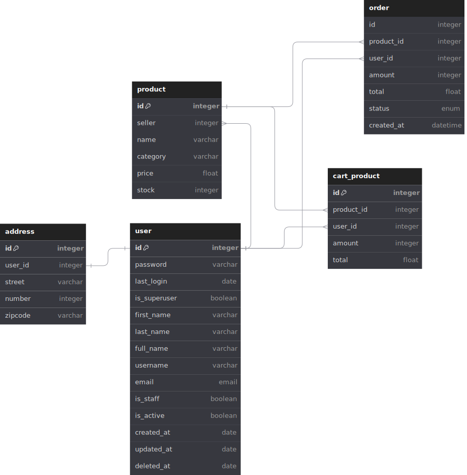

# Sistema de Gerenciamento de Vendas de Produtos

Este é um projeto de sistema de gerenciamento de vendas de produtos, desenvolvido para auxiliar o controle e a administração de uma loja virtual. O sistema permite que os usuários, incluindo administradores, vendedores e clientes, realizem diversas operações relacionadas aos produtos, pedidos, carrinhos e usuários.

## Funcionalidades

### Produtos

- Os usuários podem buscar produtos por nome, categoria e ID.
- O estoque dos produtos é mantido, e produtos com 0 unidades têm um status de indisponibilidade.
- Se um produto no carrinho estiver indisponível ao finalizar a compra, o sistema retorna um erro.
- Ao criar um pedido, a quantidade de produtos é subtraída do estoque.

### Carrinho

- Um carrinho é usado para armazenar os produtos selecionados antes de finalizar a compra.
- Ele contém a lista de produtos pedidos, juntamente com seus valores.
- Um pedido não pode ser finalizado se não houver estoque disponível.
- Se os produtos no carrinho forem de diferentes vendedores, são criados pedidos separados.

### Pedido

- Cada pedido possui um status: PEDIDO REALIZADO, EM ANDAMENTO ou ENTREGUE.
- Ao atualizar o status do pedido, um e-mail é enviado ao comprador.
- Os detalhes do pedido incluem informações sobre os produtos, exceto a quantidade em estoque.
- O vendedor pode atualizar o status do pedido.

### Endereço

- Cada usuário tem um relacionamento com um endereço.

### Usuários

- O sistema permite o cadastro de três tipos de usuários: Administrador, Vendedor e Cliente.
- Usuários não autenticados podem acessar informações básicas sobre os produtos.
- Administradores podem transformar usuários comuns em vendedores.
- Os vendedores podem cadastrar novos produtos, atualizar estoques e verificar pedidos.
- Os clientes podem se tornar vendedores, adicionar produtos ao carrinho e finalizar compras.

## Diagrama de Entidade e Relacionamento

